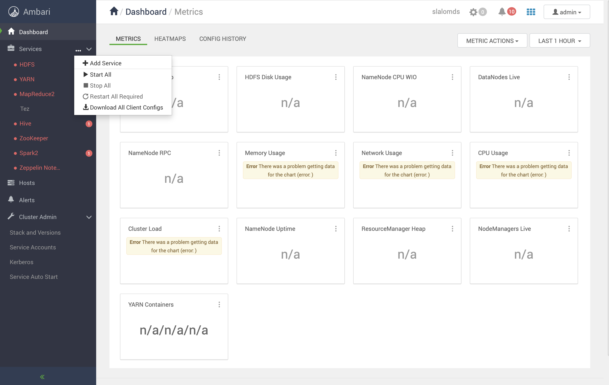
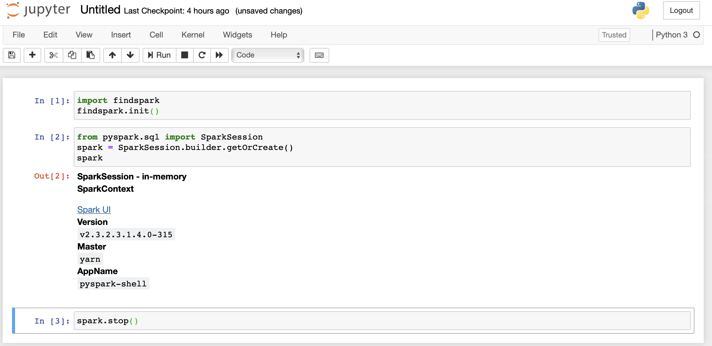

# Slalom Data Science Virtual Machine

_Created in July 2020 by [raphael.vannson@slalom.com](mailto:raphael.vannson@slalom.com?subject=[Data%20Science%20VM])._


## Provisioning a data science VM

### Pre-requisites

> Do this step only once when you you create the VM for the first time.

Execute all the pre-requisites documented in `../readme.md`.


### Register the `slalomds` box  with vagrant

> Do this step only once when you you create the VM for the first time.


```bash
# [users and developers]
vagrant box list

# If needed use a new version of the box
# WARNING: you will need to re-download the box if you do this.
# vagrant box remove slalomds   # DANGER ZONE

# [users only]
# Download the box and register it with vagrant
# Do this overnight, the box is ≈10GB, this will take a while.
# IMPORTANT: 
# Make sure your laptop is plugged-in and configured to not go to sleep.
vagrant box add --name slalomds http://...TBD...

# [developers only]
# Register the box with vagrant if you already it .box file on your laptop 
# vagrant box add --name slalomds /vagrant/boxes/slalomds.box

# [users and developers]
vagrant box list
```

### Create the VM

> Do this step every time you create a new vm from the box (ex: if you have detroyed a previous instance of the VM and you need to create a new "fresh VM").

This will create the VM from the box image previously downloaded.

```bash
cd ~/repositories/ds-vm/slalomdsvm
vagrant up
vagrant global-status
```


### Start Hadoop

 1. Open you web browser at [http://slalomdsvm:8080/](http://slalomdsvm:8080/)
 2. Login with: `admin`:`admin`
 3. Click on the `...` near `Services`, then `Start all`. (If `Start all` is grey out, wait 1 minute, then reload the page and retry. This can happen if the VM was just started while Ambari services are still initializing. If the issue persists, ssh into the VM and restart Ambari services, see below for details).
 4. Wait for all services to be started, this will take 5-6 minutes (you can see the operation progres in the pop up with the progress bars).


 
 

## Using the VM

### About the VM

 * Centos 7
 * 10GB RAM
 * 4 CPUs
 * 40GB disk (15GB already used).
 * Hadoop 3 (HDFS, YARN, Map/Reduce), Spark 2, Hive 3
 * Jupyter, Rstudio, Zeppelin, git
 * Python 3.6 and pip (`python3` and `pip3`), Java 8


### Pre-installed data

A dataset containing observations of the earth's surface temperature since 1743 is pre-installed on the VM. Locations:

 * On HDFS as CSV files: `/user/vagrant/data/earth-surface-temperature/csv`
 * One Hive table: `examples.gt_city`

### Accessing Notebooks and other services


|Component | Description | URL | login |
|----|----|----|----|
|Jupyter| Python3 and PySpark notebooks | [http://slalomdsvm:8888/](http://slalomdsvm:8888/) | N/A |
| Zeppelin | Notebook with support for Scala | [http://slalomdsvm:9995/](http://slalomdsvm:9995/) | `admin`:`admin`  |
| Rsudio | R notebooks | [http://slalomdsvm:8787/](http://slalomdsvm:8787/) | `vagrant`:`datascience`|
| Ambari | Manage Hadoop cluster | [http://slalomdsvm:8080/](http://slalomdsvm:8080/) | `admin`:`admin` |
| YARN | Resource Manager UI | [http://slalomdsvm:8088/ui2/#/cluster-overview](http://slalomdsvm:8088/ui2/#/cluster-overview) | N/A |
| Spark  | Job History UI | [http://slalomdsvm:18081/](http://slalomdsvm:18081/) | N/A |
| Map/Reduce  | Job History UI | [http://slalomdsvm:19888/jobhistory](http://slalomdsvm:19888/jobhistory) | N/A |


### Using Jupyter / Pyspark

1. Ssh into the VM (see section `Managing the VM` below).

2. To start the notebook server, run:

  ```bash
  jupyter notebook
  ```
  
3.  Open Jupyter in you web browser at [http://slalomdsvm:8888/](http://slalomdsvm:8888/).

4.  Open the example notebook located on the VM at `/home/vagrant/examples/pyspark.ipynb` or create a new one (click `New` > `Python3`).

5. Edit your notebook, to use pyspark, use this code in your notebook:

  ```python
  import findspark
  findspark.init()

  # Create a spark-session (akin to what pyspark provides when it is started)
  from pyspark.sql import SparkSession
  spark = SparkSession.builder.getOrCreate()
  spark
  ...
  spark.stop()
  
  # OR
  # Create a spark context
  import pyspark
  sc = pyspark.SparkContext()
  sc
  ...
  sc.stop()
  ```
  
  
  

6. Save your notebook and halt the kernel, (feel free to use git on the VM to commit your notebook to a repo).

7. Use CTRL-C to shutdown the notebook server when you are done.


### Using Hive

Hive is tabular datastore built to work on top of Hadoop. It is made to run "long" SQL queries on very large datasets. It is not made to support "fast" queries with high concurrency (typically used in webapps).

To use Hive:

 1. Ssh into the VM:

 ```bash
 ssh vagrant
 ```
 
 2. Launch Hive:

 ```bash
 hive
 ```
 
 ```sql
 # Example:
 use examples;
 select * from gt_city limit 10;
 +-------------+-----------------------------+----------------------------------------+---------------+------------------+-------------------+--------------------+
| gt_city.dt  | gt_city.averagetemperature  | gt_city.averagetemperatureuncertainty  | gt_city.city  | gt_city.country  | gt_city.latitude  | gt_city.longitude  |
+-------------+-----------------------------+----------------------------------------+---------------+------------------+-------------------+--------------------+
| 1849-01-01  | 26.70                       | 1.435                                  | Abidjan       | Côte D'Ivoire    | 5.63N             | 3.23W              |
| 1849-02-01  | 27.43                       | 1.362                                  | Abidjan       | Côte D'Ivoire    | 5.63N             | 3.23W              |
| 1849-03-01  | 28.10                       | 1.612                                  | Abidjan       | Côte D'Ivoire    | 5.63N             | 3.23W              |
| 1849-04-01  | 26.14                       | 1.387                                  | Abidjan       | Côte D'Ivoire    | 5.63N             | 3.23W              |
| 1849-05-01  | 25.43                       | 1.200                                  | Abidjan       | Côte D'Ivoire    | 5.63N             | 3.23W              |
| 1849-06-01  | 24.84                       | 1.402                                  | Abidjan       | Côte D'Ivoire    | 5.63N             | 3.23W              |
| 1849-07-01  | 24.06                       | 1.254                                  | Abidjan       | Côte D'Ivoire    | 5.63N             | 3.23W              |
| 1849-08-01  | 23.58                       | 1.265                                  | Abidjan       | Côte D'Ivoire    | 5.63N             | 3.23W              |
| 1849-09-01  | 23.66                       | 1.226                                  | Abidjan       | Côte D'Ivoire    | 5.63N             | 3.23W              |
| 1849-10-01  | 25.26                       | 1.175                                  | Abidjan       | Côte D'Ivoire    | 5.63N             | 3.23W              |
+-------------+-----------------------------+----------------------------------------+---------------+------------------+-------------------+--------------------+
 ```


### Managing the VM

All VM managment operations must be conducted from the VM  directory (it contains the `Vagrantfile`).

The VM will be automatically suspended if your laptop is closed, in this case you will need to run `vagrant up` to resume the VM, see below for details.

```bash
cd ~/repositories/ds-vm/slalomds
```

To resume /suspend the VM (use this when you are done using the VM):

```bash
vagrant resume
vagrant suspend
```


To boot / shutdown the VM (you will need to restart Hadoop via Ambari when you restart the VM):

```bash
vagrant up
vagrant halt
```

To ssh into the VM  (VM must be running):

```bash
# Once you are logged into the VM,
# you may use all the usual Hadoop commands,
# Example: hdfs dfs -help,  yarn application -help, spark-shell...
vagrant ssh
```

To see the status of the VM:

```bash
vagrant status

# Or from  any directory
vagrant global-status --prune
```

To destroy the VM (will delete all data on the VM, the data in the synced directory will be preserved on your laptop). Make sure to be in the directory for the correct VM.

```bash
vagrant destroy   # DANGER ZONE
```


### Sharing files between your laptop and the virtual machine

Files on your laptop under `/vagrant/synchronized` and on the VM under `/synchronized` will be... synchronized ;) . These locations act as a "tunnel" to move files between the 2 hosts.


## Managing Hadoop / Ambari

The Hadoop cluster is managed via Ambari (web UI). You will typically use Ambari to stop / start the Hadoop services as described in the `Start Hadoop` section.

Ambari services can be started and stopped easily:

```bash
vagrant ssh
```

```bash
sudo su -
ambari-server status / start / stop / restart
ambari-agent status / start / stop / restart
```

After a reboot of any Ambari service, the agent needs to register with the server before Ambari can be used to run cluster operations, this takes about a minute.


## Managing the base box

To unregister the base box from Vagrant and delete the box file:

```bash
# WARNING: This will delete the box file (≈10GB)!
# You will have to re-download the box if you want to re-use it!
# Use this only if you know what you are doing / in case of emergency.
vagrant box remove slalomds   # DANGER ZONE
```


To register the `slalomds` base box with Vagrant:

```bash
# This will download the box (≈10GB)
# Overnight download is advised
vagrant box add --name slalomds http://...TBD...
```